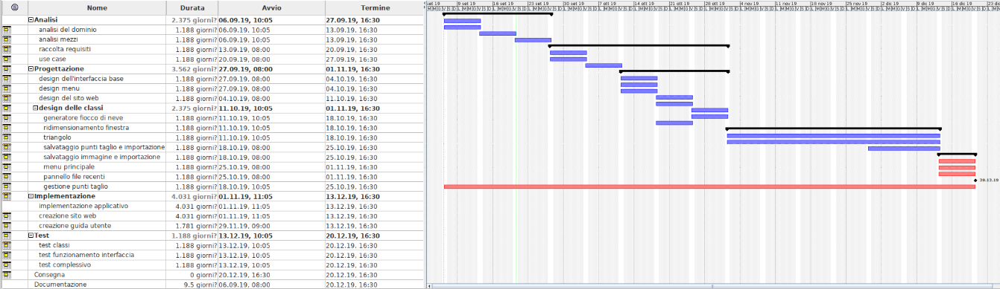
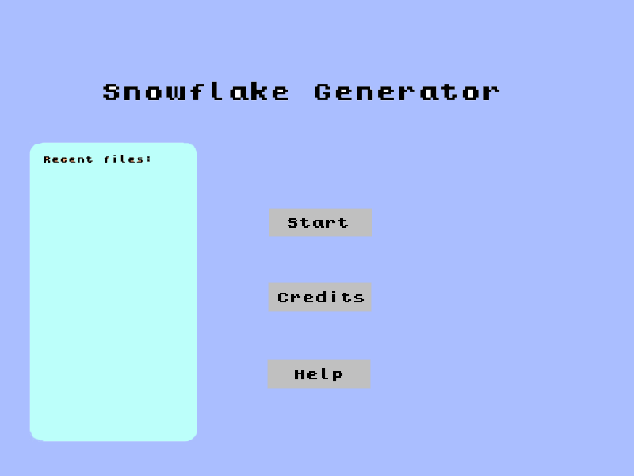
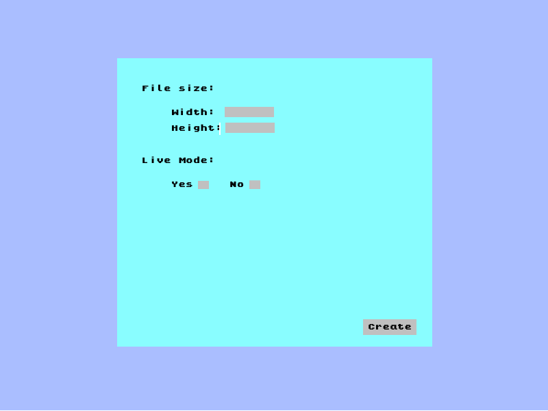
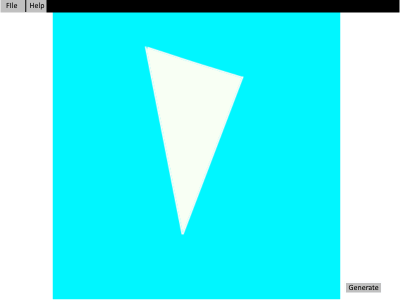
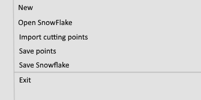

1. [Introduzione](#introduzione)

    - [Informazioni sul progetto](#informazioni-sul-progetto)

    - [Abstract](#abstract)

    - [Scopo](#scopo)

2. [Analisi](#analisi)

    - [Analisi del dominio](#analisi-del-dominio)

    - [Analisi dei mezzi](#analisi-dei-mezzi)

    - [Analisi e specifica dei requisiti](#analisi-e-specifica-dei-requisiti)

    - [Use case](#use-case)

    - [Pianificazione](#pianificazione)

3. [Progettazione](#progettazione)

    - [Design dell’architettura del sistema](#design-dell’architettura-del-sistema)

    - [Design dei dati e database](#design-dei-dati-e-database)

4. [Implementazione](#implementazione)

5. [Test](#test)

    - [Protocollo di test](#protocollo-di-test)

    - [Risultati test](#risultati-test)

    - [Mancanze/limitazioni conosciute](#mancanze/limitazioni-conosciute)

6. [Consuntivo](#consuntivo)

7. [Conclusioni](#conclusioni)

    - [Sviluppi futuri](#sviluppi-futuri)

    - [Considerazioni personali](#considerazioni-personali)

8. [Sitografia](#sitografia)

9. [Allegati](#allegati)

## Introduzione

### Informazioni sul progetto

   -   Allievo coinvolto: Julian Sprugasci (Programmatore)

  -   Docenti responsabili: Luca Muggiasca e Geo Petrini

  -   Scuola: SAMT Trevano - Sezione Informatica

  -   Classe: I3AC

  -   Materia: Modulo 306 + progetti

  -   Data d'inizio: 06.09.2019

  -   Data di fine: 20.12.2019

### Abstract

  E’ una breve e accurata rappresentazione dei contenuti di un documento,
  senza notazioni critiche o valutazioni. Lo scopo di un abstract efficace
  dovrebbe essere quello di far conoscere all’utente il contenuto di base
  di un documento e metterlo nella condizione di decidere se risponde ai
  suoi interessi e se è opportuno il ricorso al documento originale.

  Può contenere alcuni o tutti gli elementi seguenti:

  -   **Background/Situazione iniziale**
      Sono partito con l'idea che dovevo partire da un semplice triangolo di                    "carta" bianco e tramite dei tagli consecutivi simulati dal programma si potesse generare un ficco di neve e poi salvarlo.

  -   **Descrizione del problema e motivazione**: Che problema ho cercato
      di risolvere? Questa sezione dovrebbe includere l'importanza del
      vostro lavoro, la difficoltà dell'area e l'effetto che potrebbe
      avere se portato a termine con successo.
      Il problema da risolvere era quello che bisognava riuscire a creare un programma comodo e utile per creare tanti fiocchi di neve senza sprecare della carta. Se il progetto verrà portato a termine con successo, non ci saranno più spreghi di carta e si protranno creare dei fiocchi di neve molto più precisi e dettagliati di quelli su carta.
      

  -   **Approccio/Metodi**: Come ho ottenuto dei progressi? Come ho
      risolto il problema (tecniche…)? Quale è stata l’entità del mio
      lavoro? Che fattori importanti controllo, ignoro o misuro?
      In questo progetto bisognava di certo avere della base di trigonometria. Per riuscire a trovare dei metodi per risolvere i vari problemi, come per esempio girare il poligono, servino delle librerie come Affine Trasform che sono appunto dei calcoli di trigonometria. Il metodo migliore per trovare un approccio di risoluzione di un problema secondo me è quello di provare tutte le idee su carta, e una volta pensata e trovata una soluzione plausibile si può passare al codice. Bisogna sempre pensare e pianificare tutto prima di iniziare un lavoro, questo perchè se non si hanno le idee nitide si rischia di sbagliare e ricominciare da capo. Il fattore importante per risolvere il progetto è stato quello di suddividere i problemi e scomporli in sotto-problemi, iniziando da quelli più semplici per poi focalizzarsi su quelli più difficili. Questo metodo porta a non sprecare tempo e risorse in modo inutile. 

  -   **Risultati**: Quale è la risposta? Quali sono i risultati? Quanto è
      più veloce, più sicuro, più economico o in qualche altro aspetto
      migliore di altri prodotti/soluzioni?
      Per il risultato è difficile da dirlo, visto che non esistono dei prodotti del genere sul mercato. Di certo deve essere un programma semplice e veloce, con una interfaccia fatta bene e facile da usare dall'utente.

  Esempio di abstract:

  > *As the size and complexity of today’s most modern computer chips
  > increase, new techniques must be developed to effectively design and
  > create Very Large Scale Integration chips quickly. For this project, a
  > new type of hardware compiler is created. This hardware compiler will
  > read a C++ program, and physically design a suitable microprocessor
  > intended for running that specific program. With this new and powerful
  > compiler, it is possible to design anything from a small adder, to a
  > microprocessor with millions of transistors. Designing new computer
  > chips, such as the Pentium 4, can require dozens of engineers and
  > months of time. With the help of this compiler, a single person could
  > design such a large-scale microprocessor in just weeks.*

### Scopo

  Questo progetto ha lo scopo didattico principale di imparare a gestire in modo individuale
  un progetto IT. Per fare ciò dobbiamo ricorrere a tutte nozioni apprese durante
  la nostra formazione, utilizzando molti aspetti visti in varie materie, come per
  esempio la creazione e gestione di un Gantt oppure la creazione di una applicazione
  con il linguaggio Java. L'altro scopo di questo progetto sarà quello di creare un applicativo che rappresenta un triangolo di "carta", su cui tramite dei tagli consecutivi possa creare un fiocco di neve.

## Analisi

### Analisi del dominio

  I docenti supervisori che hanno stipolato le specifiche del progetto sono dalla parte del cliente e ci hanno consegnato un diario di lavoro. Il risultato finale, come spiegato nelle specifiche sarà un applicativo che avrà il compito di generare un fiocco di neve.
  L'applicazione sarà implementata in Java quindi potrà essere facilmente supportata per qualsiasi computer con una versione di Java recente. Questo prodotto non esiste sul mercato e non è un prodotto progettato per importanti lavori ma solamente per il divertimento, fornendo a qualsiasi tipo di utente, esperto o neofita, una piacevole grafica e un semplice utilizzo. Una volta soddisfatti del risultato finale sarà possibile salvarlo in un'immagine all'interno del vostro Pc.
  L'applicazione potrà essere scaricata dal nostro sito web nel quale fornirò una guida semplice e chiara su come utilizzare il prodotto e avviata tramite l'eseguibile.  

### Analisi e specifica dei requisiti

  Il progettista, dopo aver ricevuto il mandato, in collaborazione con il
  committente redige una lista di requisiti. Durante questi incontri,
  tramite interviste (da inserire nei diari), il progettista deve cercare
  di rispondere alle seguenti domande:

  -   Quali sono i bisogni del committente?

  -   Quali funzioni deve svolgere il prodotto?

  -   Come devono essere implementate?

  -   L’utente, come vorrebbe/dovrebbe interagire con il prodotto?

  -   Come verrà utilizzato il prodotto?

  -   Che tipo di interfaccia si immagina?

  -   Che prestazioni minime deve fornire il prodotto?

  -   Che grado di sicurezza deve avere il prodotto?

  -   …

  In base alla lista dei requisiti e all’analisi degli stessi, il
  progettista redige una *specifica dei requisiti* in cui elenca e
  descrive in modo dettagliato quali sono le funzionalità che il prodotto
  fornirà. La specifica dovrebbe essere abbastanza dettagliata da poter
  essere utilizzata come base per lo sviluppo, ma non troppo; ad esempio
  non dovrebbe contenere dettagli di implementazione, o definizioni
  dettagliate dell’interfaccia grafica a meno che questi non siano
  considerati cruciali. Non si deve scordare che i requisiti non
  rappresentano delle attività bensì delle caratteristiche che il prodotto
  dovrà possedere.

  |**ID**       |Req - 001                                                                          |
  |------------------|---------------------------------------------------------|
  |**Nome** |L'applicativo deve essere in Java o in JS.

                        |
  |**Priorità**      |1                                                                           |
  |**Versione**      |1.0                                                                         |
  |**Note**          |                                                                            |
  ||**Sotto requisiti**                                                        |
  |001|Se fatto in Java, necessita di un sito web con descrizione e download.   |
  |002|Se fatto in JS, necessita un sito web che ospiti l'applicativo.          |

  |**ID**       |Req - 002                                                                          |
  |------------------|---------------------------------------------------------|
  |**Nome** |Deve esserci una interfaccia grafica.

                         |
  |**Priorità**      |1                                                                           |
  |**Versione**      |1.0                                                                         |
  |**Note**          |                                                                            |
  ||**Sotto requisiti**                                                        |
  |001|La finestra deve essere ridimensionabile. |
  |002|Le dimensioni minime per la finestra sono di 1024X768                   |

  |**ID**       |Req - 003                                                                          |
  |------------------|---------------------------------------------------------|
  |**Nome** |L'area di lavoro deve essere un triangolo la cui grandezza è il 50% della finestra.

                       |
  |**Priorità** |1                                                                           |
  |**Versione**      |1.0                                                                         |
  |**Note**          |                                                                            |
  ||**Sotto requisiti**                                                        |
  |001|Il triangolo deve sempre essere centrato.   |                                                                    

  |**ID**       |Req - 004                                                                          |
  |------------------|---------------------------------------------------------|
  |**Nome** |I tagli del triangolo devono avvenire tramite un click del mouse.

                    |
  |**Priorità** |1                                                                           |
  |**Versione**      |1.0                                                                         |
  |**Note**          |                                                                            |
  ||**Sotto requisiti**                                                        |
  |001|Una volta chiuso il poligono il punto di chiusura deve essere verde.   |
  |002|Ci possono essere uno o più poligoni.   |
  |003|Non ci sono limiti per quanto riguarda la quantità di punti. Ovviamente ci si aspetta un certo buon senso da parte dell'utente.   |
  |004|I punti posso essere spostati o rimossi.   |
  |005|Con il tasto sinistro si possono spostare i punti.   |
  |006|Con il tasto destro si possono rimuovere i punti.   |

  |**ID**       |Req - 005                                                                          |
  |------------------|---------------------------------------------------------|
  |**Nome** |Deve essere possibile resettare i punti di taglio. 

                      |
  |**Priorità** |1                                                                           |
  |**Versione**      |1.0                                                                         |
  |**Note**          | |                                                                          |

  |**ID**       |Req - 006                                                                          |
  |------------------|---------------------------------------------------------|
  |**Nome** |Deve essere presente un tasto che permette di generare il fiocco di neve.

                       |
  |**Priorità** |1                                                                           |
  |**Versione**      |1.0                                                                         |
  |**Note**          | |                                                                          |

  |**ID**       |Req -  007                                                                          |
  |------------------|------------------------------------------------------------|
  |**Nome** |La generazione del fiocco deve avvenire in tempo reale, ogni modifica dei punti l'immagine del fiocco cambia di conseguenza. 

         |
  |**Priorità** |2                                                                           |
  |**Versione**      |1.0                                                                         |
  |**Note**          |                                                                            |
  ||**Sotto requisiti**                                                        |
  |001|Si può inserire questa funzione tramite un bottone.   |

  |**ID**       |Req - 008                                                                         |
  |------------------|---------------------------------------------------------|
  |**Nome** |Il lavoro deve poter essere salvato tramite un bottone.

                         |
  |**Priorità**      |1                                                                           |
  |**Versione**      |1.0                                                                         |
  |**Note**          |                                                                            |
  ||**Sotto requisiti**                                                        |
  |001|Il salvataggio deve essere in formato PNG o SVG.   |
  |002|Le dimensioni dell'immagine da salvare dovranno essere definite dall'utente al momento del salvataggio.         |

  |**ID**       |Req - 009                                                                          |
  |------------------|---------------------------------------------------------|
  |**Nome** |I punti di taglio possono essere spostati o rimossi.

                       |
  |**Priorità** |2                                                                           |
  |**Versione**      |1.0                                                                         |
  |**Note**          | |                                                                          |

  |**ID**       |Req - 010                                                                         |
  |------------------|---------------------------------------------------------|
  |**Nome** |I punti di taglio potranno essere salvati tramite un bottone oppure essere importati da un altro bottone. 

                        |
  |**Priorità**      |1                                                                           |
  |**Versione**      |1.0                                                                         |
  |**Note**          |                                                                            |
  ||**Sotto requisiti**                                                        |
  |001|Il salvataggio deve essere in formato PNG o SVG.   |
  |002|Le dimensioni dell'immagine da salvare dovranno essere definite dall'utente al momento del salvataggio.         |
  |003|Il tipo di file del salvataggio sarà un txt all'interno di una cartella del programma.         |
  |004|Il file contenente i punti viene caricato all'interno del programma tramite un bottone importa.         |

  |**ID**       |Req - 011                                                                         |
  |------------------|---------------------------------------------------------|
  |**Nome** |Creare un sito web con descrizione e possibilità di scaricare il .jar della nostra applicazione. 

                        |
  |**Priorità**      |1                                                                           |
  |**Versione**      |1.0                                                                         |
  |**Note**          |                                                                            |
  ||**Sotto requisiti**                                                        |
  |001|Il sito deve essere con dei colori adatti per tutti gli utenti.   |
  |002|Deve contenere la lista dei riquisiti di sistema.  |
  |003|Deve esserci il file per scaricare la JRE.   |
  |004|Deve contenere una guida con degli screenshots.   |

  |**ID**       |Req - 012                                                                         |
  |------------------|---------------------------------------------------------|
  |**Nome** |I punti di taglio potranno essere salvati tramite un bottone oppure essere importati da un altro bottone. 

                        |
  |**Priorità**      |1                                                                           |
  |**Versione**      |1.0                                                                         |
  |**Note**          |                                                                            |
  ||**Sotto requisiti**                                                        |
  |001|Il salvataggio deve essere in formato PNG, SVG o Raster. Sarà l'utente a decidere la scelta.   |
  |002|Le dimensioni dell'immagine da salvare sono quelle correnti, 500 0 1000.         |

  |**ID**       |Req - 013                                                                         |
  |------------------|---------------------------------------------------------|
  |**Nome** |Deve essere presente una schermata di caricamento che porterà al menu principale. 

                        |
  |**Priorità**      |1                                                                           |
  |**Versione**      |1.0                                                                         |
  |**Note**          |                                                                            |
  ||**Sotto requisiti**                                                        |
  |001|Al menu principale ci saranno delle miniature dei file precedenti.   |

  |**ID**       |Req - 014                                                                         |
  |------------------|---------------------------------------------------------|
  |**Nome** |Deve essere presente un menu principale. 

                        |
  |**Priorità**      |1                                                                           |
  |**Versione**      |1.0                                                                         |
  |**Note**          |                                                                            |
  ||**Sotto requisiti**                                                        |
  |001|Una schermata con la possibilità di caricare file recenti salvati in una cartella del programma.   |
  |002|Un bottone di start che fa partire l'applicazione.   |
  |003|Un bottone di credits dove vengono mostrate le informazioni del creatore.   |
  |003|Un bottone di help dove viene mostrata una guida su come usare l'applicazione.   |

**Spiegazione elementi tabella dei requisiti:**

**ID**: identificativo univoco del requisito

**Nome**: breve descrizione del requisito

**Priorità**: indica l’importanza di un requisito nell’insieme del
progetto, definita assieme al committente. Ad esempio poter disporre di
report con colonne di colori diversi ha priorità minore rispetto al
fatto di avere un database con gli elementi al suo interno. Solitamente
si definiscono al massimo di 2-3 livelli di priorità.

**Versione**: indica la versione del requisito. Ogni modifica del
requisito avrà una versione aggiornata.

Sulla documentazione apparirà solamente l’ultima versione, mentre le
vecchie dovranno essere inserite nei diari.

**Note**: eventuali osservazioni importanti o riferimenti ad altri
requisiti.

**Sotto requisiti**: elementi che compongono il requisito.

### Use case

I casi d’uso rappresentano l’interazione tra i vari attori e le
funzionalità del prodotto.

### Pianificazione

Prima di stabilire una pianificazione bisogna avere almeno una vaga idea
del modello di sviluppo che si intende adottare. In questa sezione
bisognerà inserire il modello concettuale di sviluppo che si seguirà
durante il progetto. Gli elementi di riferimento per una buona
pianificazione derivano da una scomposizione top-down della problematica
del progetto.

Se si usano altri metodi di pianificazione (es scrum), dovranno apparire
in questo capitolo.

### Analisi dei mezzi

Elencare e *descrivere* i mezzi disponibili per la realizzazione del
progetto. Ricordarsi di sempre descrivere nel dettaglio le versioni e il
modello di riferimento.

SDK, librerie, tools utilizzati per la realizzazione del progetto e
eventuali dipendenze.

Per realizzare questo progetto ho utilizzato i seguenti programmi:
- 

Su quale piattaforma dovrà essere eseguito il prodotto? Che hardware
particolare è coinvolto nel progetto? Che particolarità e limitazioni
presenta? Che hw sarà disponibile durante lo sviluppo?

## Progettazione

Questo capitolo descrive esaustivamente come deve essere realizzato il
prodotto fin nei suoi dettagli. Una buona progettazione permette
all’esecutore di evitare fraintendimenti e imprecisioni
nell’implementazione del prodotto.

### Design dell’architettura del sistema

Descrive:

-   La struttura del programma/sistema lo schema di rete...

-   Gli oggetti/moduli/componenti che lo compongono.

-   I flussi di informazione in ingresso ed in uscita e le
    relative elaborazioni. Può utilizzare *diagrammi di flusso dei
    dati* (DFD).

-   Eventuale sitemap

### Design delle interfacce

Descrizione delle interfacce interne ed esterne del sistema e
dell’interfaccia utente. La progettazione delle interfacce è basata
sulle informazioni ricavate durante la fase di analisi e realizzata
tramite mockups.

#### Interfaccia applicazione

##### Menu principale

Il menu principale dell'applicazione sarà suddiviso nel seguente modo.
Sarà presente un bottone di **Start** nel quale, una volta premuto apparirà la
schermata di creazione del frame con le misure gestite dall'utente. Il pulsante
**Credits** contiene le informazioni riguardanti il programmatore e la versione
del programma attuale. Infine come ultimo bottone, c'è quello di **Help** che contiene una breve guida semplice e descrittiva su come iniziare ad utilizzare il programma.
Il pannello blu a sinistra **Recent files:** verranno visualizzati al suo interno
tutti i file creati di recente dal programma che possono essere fiocchi di neve oppure i punti salvati dall'utente.

**Requisito supplementare**

Infine come ultima cosa, se resterà del tempo, verrà creata un'animazione nel Menu
principale nella quale verranno rappresentati dei fiocchi di neve creati col programma
che cadono dalla cima dello schermo fino a svanire in basso.

##### Creazione del file

Questa è la prima schermata che apparirà una volta cliccato il bottone **Start**
dal menu principale. Questa interfaccia permette all'utente di inserire la grandezza
del frame iniziale(default 1024X768) e decidere se avere la rappresentazione in
tempo reale oppure no. **Attenzione: questa operazione non potrà essere cambiata una volta fatto partire il file creato.** Una volta che si è sicuri della propria scelta si
può cliccare sul bottone **Create** e iniziare con la creazione del fiocco.

##### Creazione del fiocco

Questa sarà la schermata di creazione del fiocco di neve. In alto a sinistra sono
presenti due bottoni. Il primo bottone **File** una volta cliccato farà apparire
apparire la seguente schermata che sarà molto simile a tutte le applicazioni windows:

- **New:** Permette di creare un nuovo file.
- **Open SnowFlake:** Permette di aprire un progetto già esistente.
- **Import cutting points:** Permette di importare i punti di taglio salvati in
precedenza.
- **Save points:** Permette di salvare i punti di taglio presenti sullo schermo.
- **Save Snowflake:** Permette di salvare il fiocco di neve creato.
- **Exit:** Permette di tornare al menu principale del programma.

**Importante:** Tutti i file saranno salvati in delle cartelle apposta create all'interno della cartella del programma.

Poi sarà presente un bottone di **Help** dove ci sarà il link della guida ufficiale
presente sul sito del programma dove ferrà spiegato tutto il funzionamento del programma, in una sorta di guida utente step by step. Infine in fondo sarà presente un bottone
**Generate** dove, una volta premuto, verrà creato un fiocco di neve con i punti di
taglio.

### Design procedurale

Descrive i concetti dettagliati dell’architettura/sviluppo utilizzando
ad esempio:

-   Diagrammi di flusso e Nassi.

-   Tabelle.

-   Classi e metodi.

-   Tabelle di routing

-   Diritti di accesso a condivisioni …

Questi documenti permetteranno di rappresentare i dettagli procedurali
per la realizzazione del prodotto.

## Implementazione

In questo capitolo dovrà essere mostrato come è stato realizzato il
lavoro. Questa parte può differenziarsi dalla progettazione in quanto il
risultato ottenuto non per forza può essere come era stato progettato.

Sulla base di queste informazioni il lavoro svolto dovrà essere
riproducibile.

In questa parte è richiesto l’inserimento di codice sorgente/print
screen di maschere solamente per quei passaggi particolarmente
significativi e/o critici.

Inoltre dovranno essere descritte eventuali varianti di soluzione o
scelte di prodotti con motivazione delle scelte.

Non deve apparire nessuna forma di guida d’uso di librerie o di
componenti utilizzati. Eventualmente questa va allegata.

Per eventuali dettagli si possono inserire riferimenti ai diari.

## Test

### Protocollo di test

Definire in modo accurato tutti i test che devono essere realizzati per
garantire l’adempimento delle richieste formulate nei requisiti. I test
fungono da garanzia di qualità del prodotto. Ogni test deve essere
ripetibile alle stesse condizioni.

|Test Case      | TC-001                               |
|---------------|--------------------------------------|
|**Nome**       |Import a card, but not shown with the GUI |
|**Riferimento**|REQ-012                               |
|**Descrizione**|Import a card with KIC, KID and KIK keys with no obfuscation, but not shown with the GUI |
|**Prerequisiti**|Store on local PC: Profile\_1.2.001.xml (appendix n\_n) and Cards\_1.2.001.txt (appendix n\_n) |
|**Procedura**     | - Go to “Cards manager” menu, in main page click “Import Profiles” link, Select the “1.2.001.xml” file, Import the Profile - Go to “Cards manager” menu, in main page click “Import Cards” link, Select the “1.2.001.txt” file, Delete the cards, Select the “1.2.001.txt” file, Import the cards |
|**Risultati attesi** |Keys visible in the DB (OtaCardKey) but not visible in the GUI (Card details) |

### Risultati test

Tabella riassuntiva in cui si inseriscono i test riusciti e non del
prodotto finale. Se un test non riesce e viene corretto l’errore, questo
dovrà risultare nel documento finale come riuscito (la procedura della
correzione apparirà nel diario), altrimenti dovrà essere descritto
l’errore con eventuali ipotesi di correzione.

### Mancanze/limitazioni conosciute

Descrizione con motivazione di eventuali elementi mancanti o non
completamente implementati, al di fuori dei test case. Non devono essere
riportati gli errori e i problemi riscontrati e poi risolti durante il
progetto.

## Consuntivo

Consuntivo del tempo di lavoro effettivo e considerazioni riguardo le
differenze rispetto alla pianificazione (cap 1.7) (ad esempio Gannt
consuntivo).

## Conclusioni

Quali sono le implicazioni della mia soluzione? Che impatto avrà?
Cambierà il mondo? È un successo importante? È solo un’aggiunta
marginale o è semplicemente servita per scoprire che questo percorso è
stato una perdita di tempo? I risultati ottenuti sono generali,
facilmente generalizzabili o sono specifici di un caso particolare? ecc

### Sviluppi futuri
  Migliorie o estensioni che possono essere sviluppate sul prodotto.

### Considerazioni personali
  Cosa ho imparato in questo progetto? ecc

## Bibliografia

### Bibliografia per articoli di riviste
1.  Cognome e nome (o iniziali) dell’autore o degli autori, o nome
    dell’organizzazione,

2.  Titolo dell’articolo (tra virgolette),

3.  Titolo della rivista (in italico),

4.  Anno e numero

5.  Pagina iniziale dell’articolo,

### Bibliografia per libri

1.  Cognome e nome (o iniziali) dell’autore o degli autori, o nome
    dell’organizzazione,

2.  Titolo del libro (in italico),

3.  ev. Numero di edizione,

4.  Nome dell’editore,

5.  Anno di pubblicazione,

6.  ISBN.

### Sitografia

1.  URL del sito (se troppo lungo solo dominio, evt completo nel
    diario),

2.  Eventuale titolo della pagina (in italico),

3.  Data di consultazione (GG-MM-AAAA).

**Esempio:**

-   http://standards.ieee.org/guides/style/section7.html, *IEEE
    Standards Style Manual*, 07-06-2008.

## Allegati

Elenco degli allegati, esempio:

-   Diari di lavoro

-   Codici sorgente/documentazione macchine virtuali

-   Istruzioni di installazione del prodotto (con credenziali
    di accesso) e/o di eventuali prodotti terzi

-   Documentazione di prodotti di terzi

-   Eventuali guide utente / Manuali di utilizzo

-   Mandato e/o Qdc

-   Prodotto

-   …
